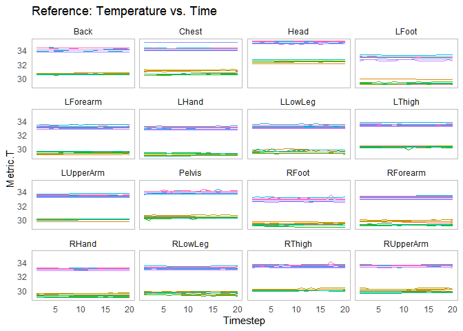
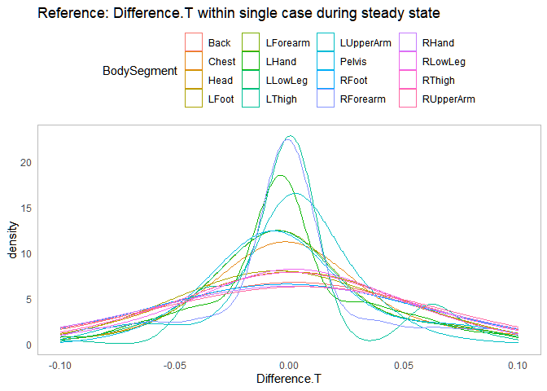
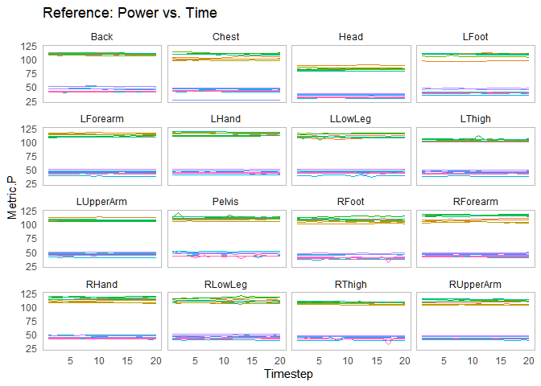
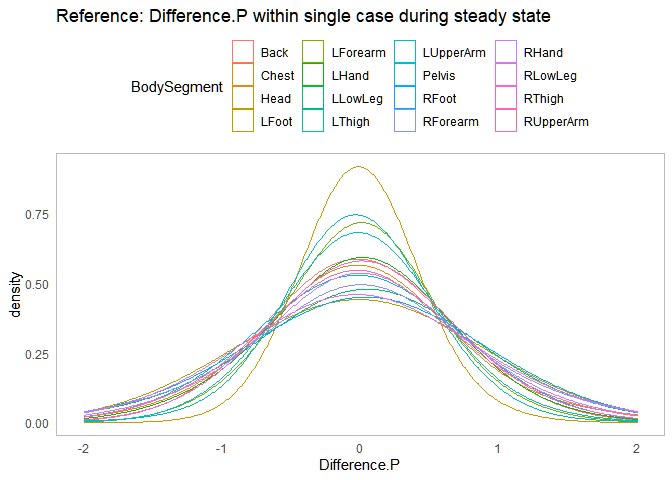
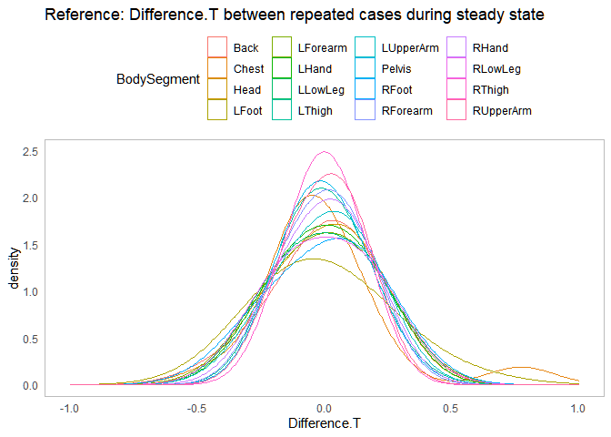
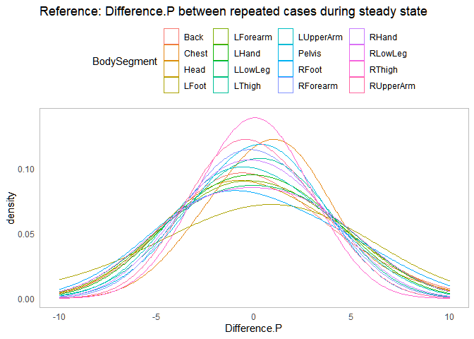

Appendix: Thermal Manikin Error and Uncertainty
================
Arfa Aijazi
3/12/2022

Plot of temperature vs time for reference cases during steady state by
body segment  
<!-- -->  
For each reference case and body segment, compute mean temperature
during steady state and difference from mean.  

``` r
reference_manikin_data_T <- all_manikin_data %>%
  filter(Reference == TRUE) %>%
  group_by(Alias, BodySegment) %>%
  mutate(Mean.T = mean(Metric.T)) %>%
  mutate(Difference.T = Metric.T - Mean.T)
```

<!-- -->  
For each body segment, compute standard deviation and standard
uncertainty.  

``` r
reference_manikin_data_T_sd <- reference_manikin_data_T %>%
  ungroup() %>%
  group_by(BodySegment) %>%
  summarise(n = n(), sd.T = sd(Difference.T)) %>%
  mutate(u = sd.T/sqrt(n)) %>%
  mutate(sd.T = round(sd.T, 2)) %>%
  mutate(u = round(u, 3))
kable(reference_manikin_data_T_sd)
```

| BodySegment |   n | sd.T |     u |
|:------------|----:|-----:|------:|
| Back        | 320 | 0.04 | 0.002 |
| Chest       | 320 | 0.04 | 0.002 |
| Head        | 320 | 0.03 | 0.002 |
| LFoot       | 320 | 0.04 | 0.002 |
| LForearm    | 320 | 0.04 | 0.002 |
| LHand       | 320 | 0.04 | 0.002 |
| LLowLeg     | 320 | 0.04 | 0.002 |
| LThigh      | 320 | 0.04 | 0.002 |
| LUpperArm   | 320 | 0.03 | 0.002 |
| Pelvis      | 320 | 0.05 | 0.003 |
| RFoot       | 320 | 0.05 | 0.003 |
| RForearm    | 320 | 0.05 | 0.003 |
| RHand       | 320 | 0.04 | 0.002 |
| RLowLeg     | 320 | 0.05 | 0.003 |
| RThigh      | 320 | 0.06 | 0.003 |
| RUpperArm   | 320 | 0.04 | 0.002 |

  
Plot of power vs time for reference cases during steady state by body
segment  
<!-- -->  
For each reference case and body segment, compute mean power during
steady state and difference from mean.  

``` r
reference_manikin_data_P <- all_manikin_data %>%
  filter(Reference == TRUE) %>%
  group_by(Alias, BodySegment) %>%
  mutate(Mean.P = mean(Metric.P)) %>%
  mutate(Difference.P = Metric.P - Mean.P)
```

<!-- -->  
For each body segment, compute standard deviation and standard
uncertainty.  

``` r
reference_manikin_data_P_sd <- reference_manikin_data_P %>%
  ungroup() %>%
  group_by(BodySegment) %>%
  summarise(n = n(), sd.P = sd(Difference.P)) %>%
  mutate(u = sd.P/sqrt(n)) %>%
  mutate(sd.P = round(sd.P, 1)) %>%
  mutate(u = round(u, 2))
kable(reference_manikin_data_P_sd)
```

| BodySegment |   n | sd.P |    u |
|:------------|----:|-----:|-----:|
| Back        | 320 |  0.4 | 0.02 |
| Chest       | 320 |  0.6 | 0.03 |
| Head        | 320 |  0.3 | 0.02 |
| LFoot       | 320 |  0.5 | 0.03 |
| LForearm    | 320 |  0.4 | 0.02 |
| LHand       | 320 |  0.5 | 0.03 |
| LLowLeg     | 320 |  0.7 | 0.04 |
| LThigh      | 320 |  0.6 | 0.03 |
| LUpperArm   | 320 |  0.4 | 0.02 |
| Pelvis      | 320 |  0.9 | 0.05 |
| RFoot       | 320 |  0.8 | 0.04 |
| RForearm    | 320 |  0.7 | 0.04 |
| RHand       | 320 |  0.7 | 0.04 |
| RLowLeg     | 320 |  0.8 | 0.04 |
| RThigh      | 320 |  0.9 | 0.05 |
| RUpperArm   | 320 |  0.6 | 0.03 |

Uncertainty between repeated cases  
Compute steady state mean T for each case, then compute mean for groups
of repeated cases and difference from group mean for each individual
case.  

``` r
repeated_manikin_data_T <- all_manikin_data %>%
  filter(Reference == TRUE) %>%
  filter(Repeated.2 == TRUE) %>% # filter cases repeated at least 2x
  group_by(Alias, BodySegment) %>%
  summarise(T.SteadyState = mean(Metric.T)) %>%
  mutate(Alias = substr(Alias, 1, nchar(Alias)-2)) %>% # removes repetition number from Alias
  group_by(Alias, BodySegment) %>%
  mutate(T.Mean = mean(T.SteadyState)) %>%
  mutate(Difference.T = T.SteadyState - T.Mean)
```

<!-- -->  
For each body segment, compute standard deviation and standard
uncertainty.  

``` r
repeated_manikin_data_T_sd <- repeated_manikin_data_T %>%
  ungroup() %>%
  group_by(BodySegment) %>%
  summarise(n = n(), sd.T = sd(Difference.T)) %>%
  mutate(u = sd.T/sqrt(n)) %>%
  mutate(sd.T = round(sd.T, 3)) %>%
  mutate(u = round(u, 2))
kable(repeated_manikin_data_T_sd)
```

| BodySegment |   n |  sd.T |    u |
|:------------|----:|------:|-----:|
| Back        |  16 | 0.178 | 0.04 |
| Chest       |  16 | 0.251 | 0.06 |
| Head        |  16 | 0.157 | 0.04 |
| LFoot       |  16 | 0.212 | 0.05 |
| LForearm    |  16 | 0.165 | 0.04 |
| LHand       |  16 | 0.155 | 0.04 |
| LLowLeg     |  16 | 0.161 | 0.04 |
| LThigh      |  16 | 0.132 | 0.03 |
| LUpperArm   |  16 | 0.148 | 0.04 |
| Pelvis      |  16 | 0.127 | 0.03 |
| RFoot       |  16 | 0.174 | 0.04 |
| RForearm    |  16 | 0.136 | 0.03 |
| RHand       |  16 | 0.137 | 0.03 |
| RLowLeg     |  16 | 0.163 | 0.04 |
| RThigh      |  16 | 0.118 | 0.03 |
| RUpperArm   |  16 | 0.119 | 0.03 |

Compute steady state mean P for each case, then compute mean for groups
of repeated cases and difference from group mean for each individual
case.  

``` r
repeated_manikin_data_P <- all_manikin_data %>%
  filter(Reference == TRUE) %>%
  filter(Repeated.2 == TRUE) %>%
  group_by(Alias, BodySegment) %>%
  summarise(P.SteadyState = mean(Metric.P)) %>%
  mutate(Alias = substr(Alias, 1, nchar(Alias)-2)) %>% # removes repetition number from Alias
  group_by(Alias, BodySegment) %>%
  mutate(P.Mean = mean(P.SteadyState)) %>%
  mutate(Difference.P = P.SteadyState - P.Mean)
```

<!-- -->  
For each body segment, compute standard deviation and standard
uncertainty

``` r
repeated_manikin_data_P_sd <- repeated_manikin_data_P %>%
  ungroup() %>%
  group_by(BodySegment) %>%
  summarise(n = n(), sd.P = sd(Difference.P)) %>%
  mutate(u = sd.P/sqrt(n)) %>%
  mutate(sd.P = round(sd.P, 3)) %>%
  mutate(u = round(u, 2))
kable(repeated_manikin_data_P_sd)
```

| BodySegment |   n |  sd.P |    u |
|:------------|----:|------:|-----:|
| Back        |  16 | 3.130 | 0.78 |
| Chest       |  16 | 4.614 | 1.15 |
| Head        |  16 | 2.975 | 0.74 |
| LFoot       |  16 | 3.967 | 0.99 |
| LForearm    |  16 | 2.960 | 0.74 |
| LHand       |  16 | 2.802 | 0.70 |
| LLowLeg     |  16 | 3.010 | 0.75 |
| LThigh      |  16 | 2.531 | 0.63 |
| LUpperArm   |  16 | 2.673 | 0.67 |
| Pelvis      |  16 | 2.336 | 0.58 |
| RFoot       |  16 | 3.288 | 0.82 |
| RForearm    |  16 | 2.497 | 0.62 |
| RHand       |  16 | 2.514 | 0.63 |
| RLowLeg     |  16 | 3.027 | 0.76 |
| RThigh      |  16 | 2.091 | 0.52 |
| RUpperArm   |  16 | 2.226 | 0.56 |
