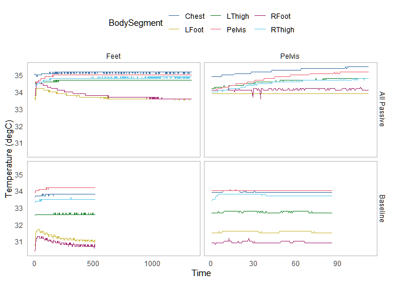

Appendix: Hot water bottle
================
Arfa Aijazi
2/28/2022

Load libraries  

``` r
library(tidyverse)
library(lubridate)
```

Read thermal manikin data  

``` r
manikin_dir <- "data/Experiment/manikin"

files_manikin <- list.files(path = manikin_dir, pattern = "*_Experiment.csv", full.names = TRUE)

colNames_manikin <- read_csv("ColumnNames.csv", col_names = F, col_types = cols())

data_manikin <- lapply(files_manikin, read_csv, skip = 5, col_names = colNames_manikin$X1, col_types = cols())
merged_manikin <- reduce(data_manikin, full_join)
  
  
data_manikin <- merged_manikin %>%
  select(-ends_with(".Clo"), 
         -ends_with(".Teq"), 
         -ends_with(".PMV"), 
         -ends_with(".PPD"), 
         -ends_with(".SET"), 
         -ends_with(".ET"), 
         -starts_with("All"), 
         -starts_with("GroupA"), 
         -starts_with("GroupB"),
         -Runtime) %>%
  mutate(Time = mdy_hms(Time)) %>%
  drop_na(Time) %>%
  pivot_longer(cols = ends_with(".T") | ends_with(".P"),
               names_to = c("BodySegment", "Metric"),
               names_sep = "[.]") %>%
  pivot_wider(names_from = Metric, names_prefix = "Metric.", values_from = value)

rm(merged_manikin) 
```

Subset HW Bottle Data  

``` r
hwbottle_times <- read_csv("data/ExperimentalMatrix.csv", col_types = cols()) %>%
  mutate(Start.Time = mdy_hm(Start.Time)) %>%
  mutate(End.Time = mdy_hm(End.Time)) %>%
  mutate(Alias = paste(Chamber.SetPoint, Clothing, Bedding, Posture, Emergency.Blanket, Bed.Type, PCS, Repetition, sep = "_")) %>%
  filter(grepl("HWBottle", PCS)) %>%
  mutate(Baseline = case_when(Clothing == "Light" ~ "Baseline",
                              Clothing == "Heavy" ~ "All Passive"))
```

``` r
hwbottle_data <- data.frame(Baseline = character(),
                            PCS = character(),
                            Time = POSIXct(),
                            BodySegment = character(),
                            Metric.T = double(),
                            Metric.P = double())

for (i in 1:nrow(hwbottle_times)) {
  subset_manikin <- data_manikin %>%
    filter(between(Time, hwbottle_times$Start.Time[i], hwbottle_times$End.Time[i]-minutes(1))) %>%
    mutate(Baseline = hwbottle_times$Baseline[i]) %>%
    mutate(PCS = hwbottle_times$PCS[i])
  
  hwbottle_data <- full_join(hwbottle_data, subset_manikin)
    
}

hwbottle_all <- hwbottle_data %>%
   filter(BodySegment == "Pelvis" | BodySegment == "Chest" | BodySegment == "LThigh" | BodySegment == "RThigh" | BodySegment == "LFoot" | BodySegment == "RFoot") %>%
  group_by(Baseline, PCS, BodySegment) %>%
  mutate(Timestep = row_number()*30) %>%
  mutate(Timestep = Timestep/60) %>%
  mutate(Position = case_when(PCS == "HWBottleFeet" ~ "Feet",
                              PCS == "HWBottlePelvis" ~ "Pelvis"))

hwbottle_120 <- hwbottle_all %>%
  filter(Timestep <= 120)

hwbottle_steady <- hwbottle_120 %>%
  filter(between(Timestep, 25, 35))
```

Temperature versus time (full run) 

<!-- -->

Power versus time (full run)   
<!-- -->

Temperature versus time (first 120 minutes (2 hours))   
<!-- -->

Power versus time (first 120 minutes (2 hours))   
<!-- -->

Temperature versus time (steady state (minutes 60-70)) 
<!-- -->

Power versus time (steady state (minutes 60-70)) 
<!-- -->
