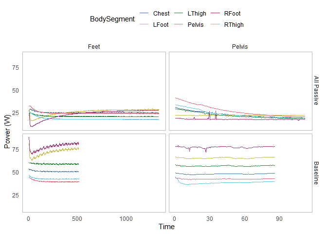

Appendix: Hot water bottle
================
Arfa Aijazi
2/28/2022

Load libraries  

``` r
library(tidyverse)
library(lubridate)
```

Read thermal manikin data  

``` r
manikin_dir <- "data/Experiment/manikin"

files_manikin <- list.files(path = manikin_dir, pattern = "*_Experiment.csv", full.names = TRUE)

colNames_manikin <- read_csv("ColumnNames.csv", col_names = F, col_types = cols())

data_manikin <- lapply(files_manikin, read_csv, skip = 5, col_names = colNames_manikin$X1, col_types = cols())
merged_manikin <- reduce(data_manikin, full_join)
  
  
data_manikin <- merged_manikin %>%
  select(-ends_with(".Clo"), 
         -ends_with(".Teq"), 
         -ends_with(".PMV"), 
         -ends_with(".PPD"), 
         -ends_with(".SET"), 
         -ends_with(".ET"), 
         -starts_with("All"), 
         -starts_with("GroupA"), 
         -starts_with("GroupB"),
         -Runtime) %>%
  mutate(Time = mdy_hms(Time)) %>%
  drop_na(Time) %>%
  pivot_longer(cols = ends_with(".T") | ends_with(".P"),
               names_to = c("BodySegment", "Metric"),
               names_sep = "[.]") %>%
  pivot_wider(names_from = Metric, names_prefix = "Metric.", values_from = value)

rm(merged_manikin) 
```

Subset HW Bottle Data  

``` r
hwbottle_times <- read_csv("data/ExperimentalMatrix.csv", col_types = cols()) %>%
  mutate(Start.Time = mdy_hm(Start.Time)) %>%
  mutate(End.Time = mdy_hm(End.Time)) %>%
  mutate(Alias = paste(Chamber.SetPoint, Clothing, Bedding, Posture, Emergency.Blanket, Bed.Type, PCS, Repetition, sep = "_")) %>%
  filter(PCS == "HWBottle")
```

``` r
hwbottle_data <- data.frame(Baseline = logical(),
                            Time = POSIXct(),
                            BodySegment = character(),
                            Metric.T = double(),
                            Metric.P = double())

for (i in 1:nrow(hwbottle_times)) {
  subset_manikin <- data_manikin %>%
    filter(between(Time, hwbottle_times$Start.Time[i], hwbottle_times$End.Time[i]-minutes(1))) %>%
    mutate(Baseline = hwbottle_times$Baseline[i])
  
  hwbottle_data <- full_join(hwbottle_data, subset_manikin)
    
}

hwbottle_plot <- hwbottle_data %>%
  filter(BodySegment == "Pelvis" | BodySegment == "Chest" | BodySegment == "LThigh" | BodySegment == "RThigh" | BodySegment == "Back") %>%
  pivot_longer(cols = starts_with("Metric."), names_to = "Metric", names_prefix = "Metric.", values_to = "Value") %>%
  mutate(Baseline = case_when(Baseline == TRUE ~ "Baseline",
                              Baseline == FALSE ~ "All Passive")) %>%
  mutate(Metric = case_when(Metric == "T" ~ "Temperature (degC)",
                            Metric == "P" ~ "Power (W/m2)"))

hwbottle_steady <- hwbottle_data %>%
  group_by(Baseline, BodySegment) %>%
  slice_tail(n = 20) %>%
  filter(BodySegment == "Pelvis" | BodySegment == "Chest" | BodySegment == "LThigh" | BodySegment == "RThigh" | BodySegment == "Back") %>%
  pivot_longer(cols = starts_with("Metric."), names_to = "Metric", names_prefix = "Metric.", values_to = "Value") %>%
  mutate(Baseline = case_when(Baseline == TRUE ~ "Baseline",
                              Baseline == FALSE ~ "All Passive")) %>%
  mutate(Metric = case_when(Metric == "T" ~ "Temperature (degC)",
                            Metric == "P" ~ "Power (W/m2)"))
```

HW Bottle temperature and power over time (full run) 
<!-- -->

HW Bottle temperature and power over time (last 10 minutes)  
<!-- -->
