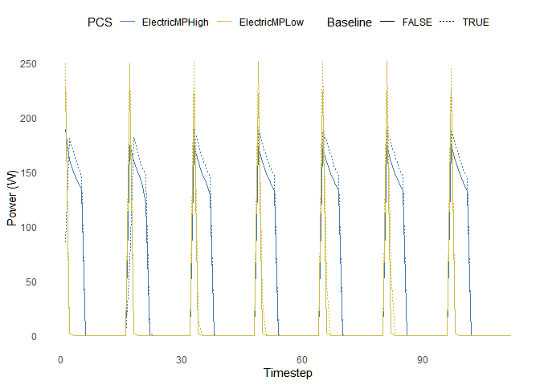
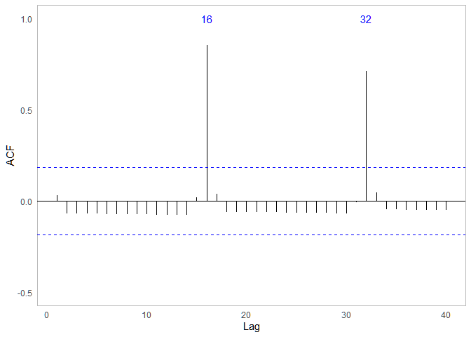
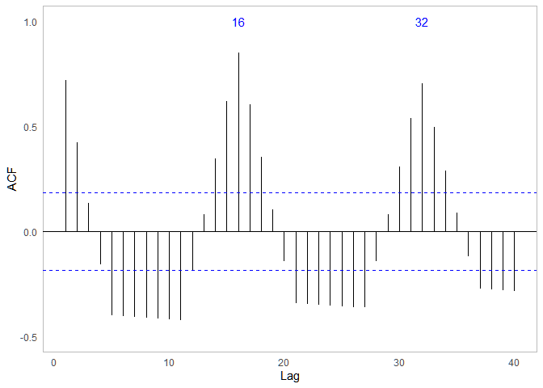
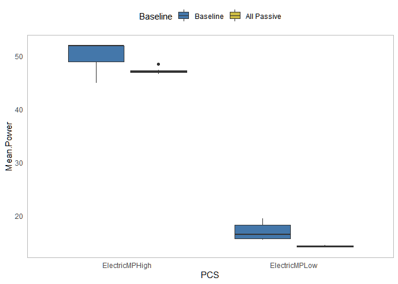
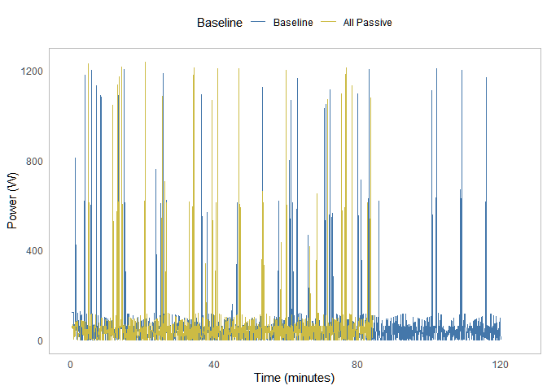
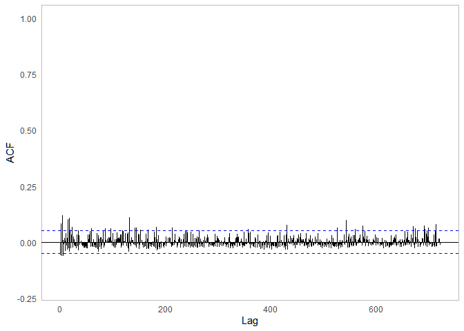
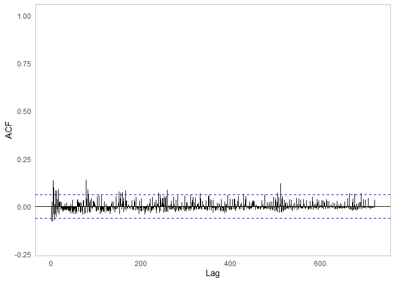
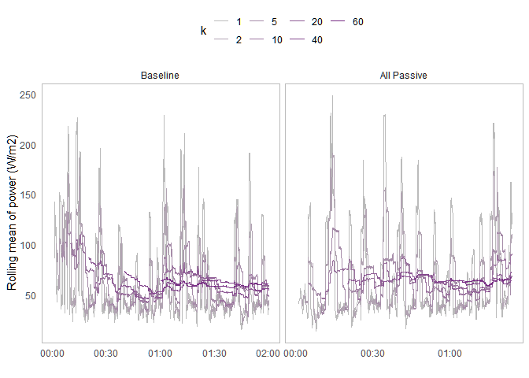
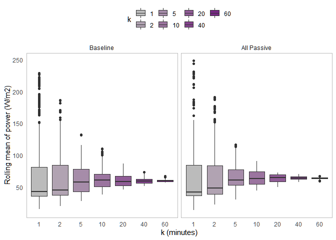

Appendix: Power
================
Arfa Aijazi
3/2/2022

Load libraries  

``` r
library(tidyverse)
library(lubridate)
library(forecast)
library(zoo)
```

Load power data for all PCS  

``` r
data_dir <- "data/Power"

colNames_hobo <- c("PCS", "Baseline", "Time", "Power", "Cycle")
data_files <- list.files(path = data_dir, pattern = "*.csv", full.names = TRUE)

data_all <- lapply(data_files, read_csv, col_types = cols())

PCS_data <- data_all %>%
  reduce(full_join) %>%
  mutate(Time = mdy_hms(Time)) %>%
  drop_na(Power) %>%
  mutate(Baseline = case_when(Baseline == TRUE ~ "Baseline",
                              Baseline == FALSE ~ "All Passive")) %>%
  mutate(Baseline = factor(Baseline, levels = c("Baseline", "All Passive")))
```

## Electric mattress pad

Plot power consumption of electric mattress pad over time  
<!-- -->  
Plot autocorrelation function  
ElectricMPLow\_Baseline  
<!-- -->  
ElectricMPHigh\_Baseline  
<!-- -->  
ElectricMPLow\_AllPassive  
<!-- -->  
ElectricMP\_AlHighlPassive  
<!-- -->  
Electric mattress pad power is periodic with a lag of 16 time steps,
which equals 16\*5 seconds or around 1 minute and 20 seconds.  

Average power consumption in each cycle  

``` r
ElectricMP_avg <- ElectricMP_data %>%
  group_by(PCS, Baseline, Cycle) %>%
  summarize(Mean.Power = mean(Power))
```

Plot average power consumption by mattress pad setting and manikin
clothing/bedding. Use of heavy clothing and bedding reduces electric
mattress pad power consumption by approximately 3 W.  
<!-- -->  

``` r
ElectricMP_avg <- ElectricMP_data %>%
  group_by(PCS, Baseline) %>%
  summarize(Mean.Power = mean(Power))
ElectricMP_avg
```

    ## # A tibble: 4 x 3
    ## # Groups:   PCS [2]
    ##   PCS            Baseline    Mean.Power
    ##   <chr>          <fct>            <dbl>
    ## 1 ElectricMPHigh Baseline          50.1
    ## 2 ElectricMPHigh All Passive       47.2
    ## 3 ElectricMPLow  Baseline          17.0
    ## 4 ElectricMPLow  All Passive       14.2

## Heated blanket

<!-- -->  
Plot autocorrelation function  
HeatedBlanket\_Baseline  
<!-- -->  
HeatedBlanket\_AllPassive  
<!-- -->  
Heated blanket power is not periodic. Check rolling mean at different
intervals (k = 1, 2, 5, 10, 20, 40, 60 minutes).  

``` r
HeatedBlanket_rollmean <- HeatedBlanket_data %>%
  group_by(Baseline) %>%
  mutate(mean = mean(Power)) %>%
  mutate(rm.1 = rollmean(Power, k = 12, na.pad = TRUE, align = "right")) %>%
  mutate(rm.2 = rollmean(Power, k = 24, na.pad = TRUE, align = "right")) %>%
  mutate(rm.5 = rollmean(Power, k = 60, na.pad = TRUE, align = "right")) %>%
  mutate(rm.10 = rollmean(Power, k = 120, na.pad = TRUE, align = "right")) %>%
  mutate(rm.20 = rollmean(Power, k = 240, na.pad = TRUE, align = "right")) %>%
  mutate(rm.40 = rollmean(Power, k = 480, na.pad = TRUE, align = "right")) %>%
  mutate(rm.60 = rollmean(Power, k = 720, na.pad = TRUE, align = "right")) %>%
  pivot_longer(cols = starts_with("rm."), names_to = "k", names_prefix = "rm.", values_to = "rm") %>%
  mutate(k = as.numeric(k)) %>%
  mutate(k = factor(k))
```

<!-- -->
<!-- -->
