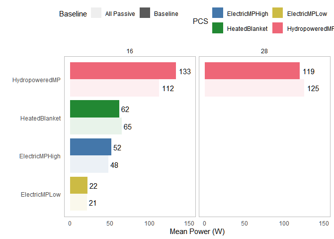

Appendix: Power
================
Arfa Aijazi
3/2/2022

Load libraries  

``` r
library(tidyverse)
library(lubridate)
library(forecast)
library(zoo)
```

Load power data for all PCS  

``` r
data_dir <- "data/Power"

colNames_hobo <- c("Chamber.SetPoint", "PCS", "Baseline", "Time", "Power", "Cycle")
data_files <- list.files(path = data_dir, pattern = "*.csv", full.names = TRUE)

data_all <- lapply(data_files, read_csv, col_types = cols())

PCS_data <- data_all %>%
  reduce(full_join) %>%
  mutate(Time = mdy_hms(Time)) %>%
  drop_na(Power) %>%
  mutate(Baseline = case_when(Baseline == TRUE ~ "Baseline",
                              Baseline == FALSE ~ "All Passive")) %>%
  mutate(Baseline = factor(Baseline, levels = c("Baseline", "All Passive")))
```

<!-- -->  
Heated blanket power is not periodic. Check rolling mean at different
intervals (k = 1, 2, 5, 10, 20, 40, 60 minutes).  

``` r
HeatedBlanket_data <- PCS_data %>%
  filter(PCS == "HeatedBlanket")

HeatedBlanket_rollmean <- HeatedBlanket_data %>%
  group_by(Baseline) %>%
  mutate(mean = mean(Power)) %>%
  mutate(rm.1 = rollmean(Power, k = 12, na.pad = TRUE, align = "right")) %>%
  mutate(rm.2 = rollmean(Power, k = 24, na.pad = TRUE, align = "right")) %>%
  mutate(rm.5 = rollmean(Power, k = 60, na.pad = TRUE, align = "right")) %>%
  mutate(rm.10 = rollmean(Power, k = 120, na.pad = TRUE, align = "right")) %>%
  mutate(rm.20 = rollmean(Power, k = 240, na.pad = TRUE, align = "right")) %>%
  mutate(rm.40 = rollmean(Power, k = 480, na.pad = TRUE, align = "right")) %>%
  mutate(rm.60 = rollmean(Power, k = 720, na.pad = TRUE, align = "right")) %>%
  pivot_longer(cols = starts_with("rm."), names_to = "k", names_prefix = "rm.", values_to = "rm") %>%
  mutate(k = as.numeric(k)) %>%
  mutate(k = factor(k))
```

<!-- -->
<!-- -->

``` r
PCS_avg <- PCS_data %>%
  group_by(Chamber.SetPoint, PCS, Baseline) %>%
  summarise(Mean.Power = mean(Power)) %>%
  mutate(Baseline = factor(Baseline, levels = c("All Passive", "Baseline"))) %>%
  mutate(Mean.Power = round(Mean.Power))
PCS_avg
```

    ## # A tibble: 10 x 4
    ## # Groups:   Chamber.SetPoint, PCS [5]
    ##    Chamber.SetPoint PCS            Baseline    Mean.Power
    ##               <dbl> <chr>          <fct>            <dbl>
    ##  1               16 ElectricMPHigh Baseline            52
    ##  2               16 ElectricMPHigh All Passive         48
    ##  3               16 ElectricMPLow  Baseline            22
    ##  4               16 ElectricMPLow  All Passive         21
    ##  5               16 HeatedBlanket  Baseline            62
    ##  6               16 HeatedBlanket  All Passive         65
    ##  7               16 HydropoweredMP Baseline           133
    ##  8               16 HydropoweredMP All Passive        112
    ##  9               28 HydropoweredMP Baseline           119
    ## 10               28 HydropoweredMP All Passive        125

<!-- -->
