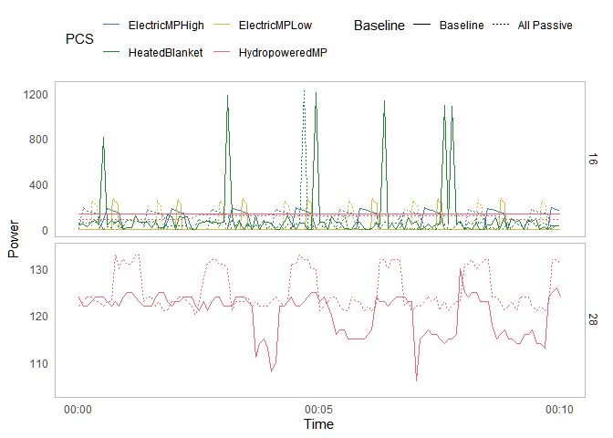

Appendix: Power
================
Arfa Aijazi
2/26/2022

Load libraries

``` r
library(tidyverse)
library(lubridate)
```

Load power data for electric mattress pad

``` r
data_dir <- "data/Power"
data_merged <- list()

colNames_hobo <- c("PCS", "Baseline", "Time", "Power", "Cycle")
data_files <- list.files(path = data_dir, pattern = "*.csv", full.names = TRUE)

data_all <- lapply(data_files, read_csv, col_types = cols())

ElectricMP_data <- data_all %>%
  reduce(full_join) %>%
  filter(is.na(Cycle) == FALSE) %>% #remove partial power cylces
  group_by(PCS, Baseline) %>%
  mutate(rowNumber = 1:n())
```

Plot power consumption of electric mattress pad over time  
<!-- -->

Average power consumption in each cycle

``` r
ElectricMP_avg <- ElectricMP_data %>%
  group_by(PCS, Baseline, Cycle) %>%
  summarize(Mean.Power = mean(Power))
```

Plot average power consumption by mattress pad setting and manikin
clothing/bedding. Use of heavy clothing and bedding reduces electric
mattress pad power consumption by approximately 3 W.  
<!-- -->

``` r
ElectricMP_avg <- ElectricMP_data %>%
  group_by(PCS, Baseline) %>%
  summarize(Mean.Power = mean(Power))
ElectricMP_avg
```

    ## # A tibble: 4 x 3
    ## # Groups:   PCS [2]
    ##   PCS            Baseline Mean.Power
    ##   <chr>          <lgl>         <dbl>
    ## 1 ElectricMPHigh FALSE          47.2
    ## 2 ElectricMPHigh TRUE           50.1
    ## 3 ElectricMPLow  FALSE          14.2
    ## 4 ElectricMPLow  TRUE           17.0
