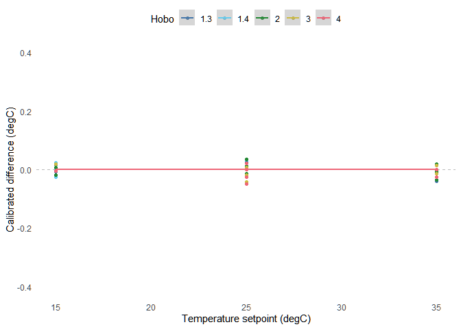

Appendix: HOBO Calibration and Uncertainty
================
Arfa Aijazi
3/13/2022

Load libraries

``` r
library(tidyverse)
library(lubridate)
library(broom)
library(knitr)
```

Load HOBO raw data

``` r
data_dir <- "calibration/hobo"
data_merged <- list()

for (i in 1:4){
  data_files <- list.files(path = data_dir, pattern = paste0("*_", i, ".csv"), full.names = TRUE)
  
  # Hobo 1 contains two temperature sensors
  if(i == 1){
    colNames_hobo <-c("Number", "Time", "Hobo_1.3", "Hobo_1.4", "HostConnected", "Stopped", "EndOfFile")
  }
  
  else{
    colNames_hobo <- c("Number", "Time", paste0("Hobo_",i), "HostConnected", "Stopped", "EndOfFile")
  }
  
  data_all <- lapply(data_files, read_csv, skip = 2, col_names = colNames_hobo, col_types = cols())
  data_merged[[i]] <- data_all %>%
  reduce(full_join) %>%
  select(-Number, -HostConnected, -Stopped, -EndOfFile) %>%
  pivot_longer(cols = starts_with("Hobo_"), names_to = "Hobo", names_prefix = "Hobo_", values_to = "Temperature_F")
}

hobo_data <- data_merged %>%
  reduce(full_join) %>%
  mutate(Temperature_C = (Temperature_F-32)*5/9) %>%
  mutate(Hobo = as.numeric(Hobo)) %>%
  mutate(Time = case_when(Hobo == 4 ~ mdy_hm(Time),
                          TRUE ~ mdy_hms(Time))) %>%
  select(-Temperature_F) %>%
  mutate(Temperature_C = round(Temperature_C, 3))

rm(merged_calibration)
rm(data_calibration)
rm(data_merged)
rm(data_all)
```

Subset HOBO data to steady state periods

``` r
# Read start and stop times for each HOBO and set point
startStop <- read_csv("calibration/startstop.csv", col_types = cols())

hobo_steady <- hobo_data %>%
  left_join(startStop) %>%
  mutate(across(c(starts_with("Start_"), starts_with("End_")), mdy_hm)) %>%
  mutate(steady_15 = ifelse(Time > Start_15 & Time < End_15, TRUE, FALSE)) %>%
  mutate(steady_25 = ifelse(Time > Start_25 & Time < End_25, TRUE, FALSE)) %>%
  mutate(steady_35 = ifelse(Time > Start_35 & Time < End_35, TRUE, FALSE)) %>%
  mutate(steady = ifelse(steady_15 == TRUE | steady_25 == TRUE | steady_35 == TRUE, TRUE, FALSE)) %>%
  filter(steady == TRUE) %>%
  mutate(Hobo = factor(Hobo)) %>%
  mutate(steadyT = case_when(steady_15 == TRUE ~ 15,
                            steady_25 == TRUE ~ 25, 
                            steady_35 == TRUE ~ 35)) %>%
  mutate(difference = Temperature_C - steadyT) %>%
  group_by(Hobo) %>%
  arrange(steadyT) %>%
  mutate(rowNumber = 1:n()) %>%
  select(Hobo, rowNumber, Temperature_C, steadyT) %>%
  mutate(Difference = Temperature_C - steadyT)
```

Temperature versus time step (during steady state)  
<!-- -->

Difference from set point temperature versus time step (during steady
state)  
<!-- -->

Difference from set point temperature versus set point temperature
(during steady state)  
<!-- -->

Calculate coefficient for linear model where the temperature difference
is a function of set point temperature

``` r
hobo_lm <- hobo_steady %>%
  group_by(Hobo) %>%
  do(tidy(lm(Difference ~ steadyT, .))) %>%
  select(-std.error, -statistic, -p.value) %>%
  mutate(term = case_when(term == "(Intercept)" ~ "Intercept", 
                          TRUE ~ "Slope")) %>%
  mutate(estimate = round(estimate, digits = 5)) %>%
  pivot_wider(names_from = term, values_from = estimate)

write_csv(hobo_lm, "HOBO_Calibration.csv")

hobo_lm
```

    ## # A tibble: 5 x 3
    ## # Groups:   Hobo [5]
    ##   Hobo  Intercept   Slope
    ##   <fct>     <dbl>   <dbl>
    ## 1 1.3      0.153  0.00038
    ## 2 1.4      0.0808 0.00312
    ## 3 2        0.264  0.00318
    ## 4 3       -0.113  0.00198
    ## 5 4        0.0290 0.00053

Calculate calibrated temperature based on linear model

``` r
hobo_calibrate <- hobo_steady %>%
  left_join(hobo_lm) %>%
  mutate(Offset = Intercept + Temperature_C*Slope) %>%
  mutate(Temperature_C_calibrate = Temperature_C - Offset) %>%
  mutate(Temperature_C_calibrate = round(Temperature_C_calibrate, 3)) %>%
  mutate(Difference.calibrated = Temperature_C_calibrate - steadyT)
```

Calibrated temperature versus time step (during steady state)  
<!-- -->

Calibrated difference from set point temperature versus time step
(during steady state)  
<!-- -->

New difference from set point temperature versus set point temperature
(during steady state)  
<!-- -->  
Plot of difference between calibrated temperature and set point by
HOBO  
<!-- -->

  
Compute standard deviation and standard uncertainty for each HOBO
thermal sensor  

``` r
sd_hobo <- hobo_calibrate %>%
  ungroup() %>%
  group_by(Hobo) %>%
  summarise(n = n(), sd = sd(Difference.calibrated)) %>%
  mutate(u = sd/sqrt(n)) %>%
  mutate(sd = round(sd, 3)) %>%
  mutate(u = round(u, 4))
kable(sd_hobo)
```

| Hobo |    n |    sd |     u |
|:-----|-----:|------:|------:|
| 1.3  | 1005 | 0.013 | 4e-04 |
| 1.4  | 1005 | 0.009 | 3e-04 |
| 2    | 1176 | 0.012 | 3e-04 |
| 3    |  984 | 0.018 | 6e-04 |
| 4    |  948 | 0.011 | 4e-04 |
